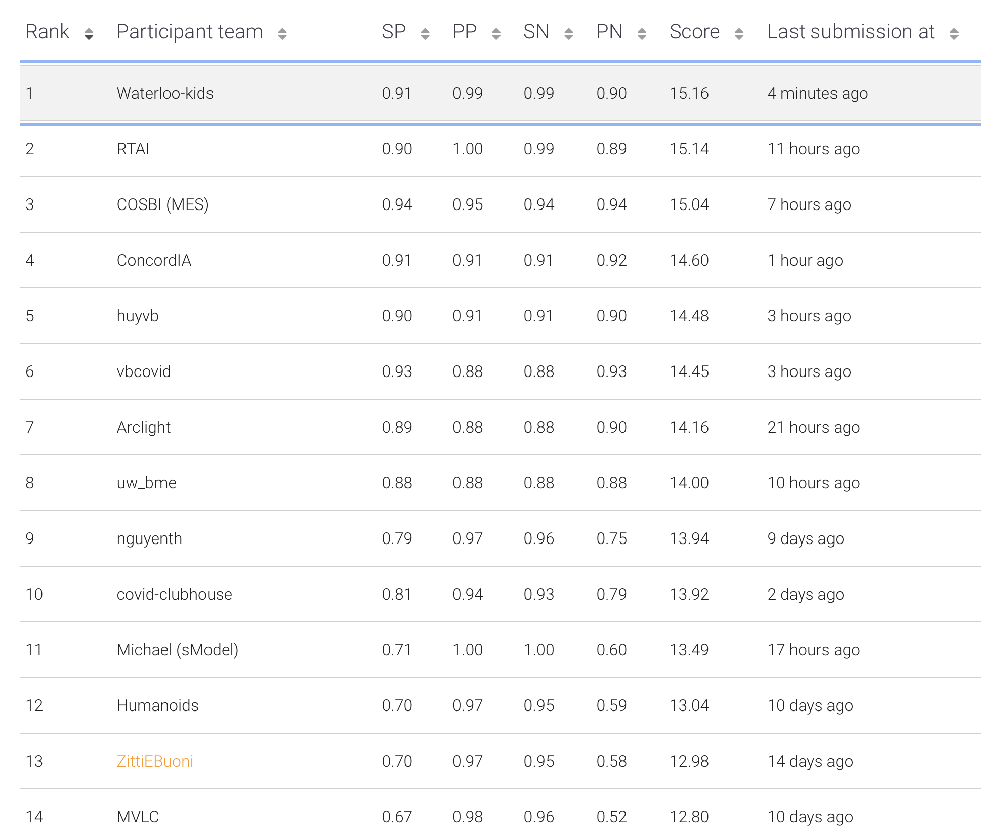

# Covid X-ray ML Competition

## About Competition
- Competition Details: https://r7.ieee.org/montreal-sight/ai-against-covid-19/#Dates
- Dataset (Kaggle): https://www.kaggle.com/andyczhao/covidx-cxr2
- eval.ai (Submission): https://eval.ai/web/challenges/challenge-page/925/evaluation

### Opening Ceremony Notes:

- eval.ai registration of participation starts May 31st
- You may use test (more like validation) and train dataset for training the model
- test dataset is unknown


## Instructions
1. ```$ mkdir data```
2. Prepare to download dataset locally and unzip to "data/*" folder
3. TODO

## Documentation:
### Background:
1. Understanding resnet from scratch: https://jarvislabs.ai/blogs/resnet
2. Checklist on squeezing the shit out of your model: http://karpathy.github.io/2019/04/25/recipe/

### Our Best Run:
- Local (Python): https://github.com/JXproject/covid-xray-detection/blob/master/src_code/main_covid_prediction.py
- Colab Version (Best Jupyter Notebook): https://github.com/JXproject/covid-xray-detection/blob/master/src_code/covid-colab.ipynb

### Hardware:
- Local: GTX 980 Ti
- Cloud: Google Colab Pro

### Description:
- There are two approaches to make a better predictions on given dataset:
    1. Use a decent model that works well with the task.
    2. Engineer the dataset to make the model more efficient and effective when learning.
    
- The base model is a simple and basic **Resnet34** (https://jarvislabs.ai/blogs/resnet), for its lightweight and adaptive properties for the given task on chest COVID detection.

- Due to limitation of my hardware (only have a GTX980Ti 6GB), I was not able to go with a deeper model and pytorch built-in model. The **Resnet34** was selected for the task, resulting a 70-80% accuracies on the evaluation test dataset provided.

- The training dataset was discovered to be quite imbalanced:
  
    
    
- For simplicity, the dataset is randomly downsampled for -ve dataset, with +ve dataset unchanged.

- To further improve the performance, we start to engineer the dataset to better utilize the model we use:
    - The initial thought is that the provided image has RGB channels exactly same to provide a black and white image, hence three channels have duplicated information, which is redundant for **Resnet34**.
    - In classical computer vision, we would use morphological operators (dilation and erosion) to extract features from the image. In addition, we figure out whether patient has COVID-19 based on the abnormal features within the chest scan. As a result, the idea is to provide **Resnet34** a sense of where the the chest region is and where the features are, with dilation and erosion respectively. Hence, we can utilize the three channels with R:(gray image), G:(erosion image), B:(dilation image), and the **Resnet34** can now fully utilize all three channels to produce a better prediction:
        
    - Sample training dataset becomes:
        
    
- As a result, the performance is quite well:
    ![training_progress[v6-custom-with-aug-10]](img/training_progress[v6-custom-with-aug-10].png)
    
- Lastly, to further push the model performance and robustness, we doubled the dataset with random zoom and rotation. To note, we have also tweaked around the learning rate and stopping criteria to find the best parameters

- To note, we pre-generate the training dataset in advance to improve the run-time efficiency.

- Overall, the best competition scored model (with just 6 epochs): 

    
    
- Ranking (s1/28):

    
    
- Output:
```
[2021-06-15 22:58:19.149098]: > epoch 107/200:
[2021-06-15 22:58:19.151170]:   >> Learning (wip) 
[2021-06-15 22:59:51.925127]:   >> Testing (wip) 
[2021-06-15 22:59:54.826188]:     epoch 107 > Training: [LOSS: -0.9966 | ACC: 0.9969] | Testing: [LOSS: -0.9927 | ACC: 0.9950] Ellapsed: 92.77 s | rate:2.89743

[2021-06-15 22:59:54.844606]: > Found Best Model State Dict saved @/content/drive/MyDrive/dataset-folder/output/CUSTOM-MODEL/v6-custom-with-aug-10/models/best_state_dict_107:200.pth [False]
[2021-06-15 22:59:55.005173]: Best Classification Report:
----------------------
[2021-06-15 22:59:55.007065]:               precision    recall  f1-score   support

    positive       0.99      1.00      1.00       200
    negative       1.00      0.99      0.99       200

    accuracy                           0.99       400
   macro avg       1.00      0.99      0.99       400
weighted avg       1.00      0.99      0.99       400
```
